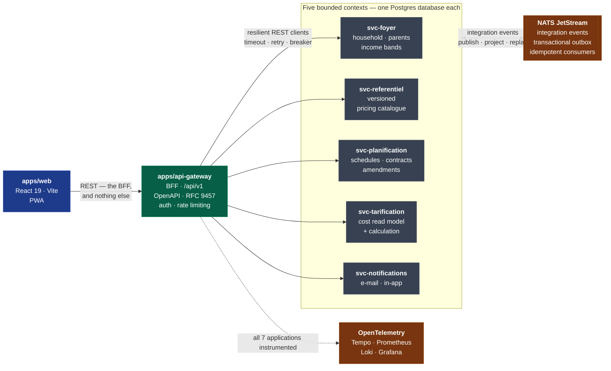

# Martha

**A family childcare cost planner — a solo-built, production-deployed microservice
platform in TypeScript, engineered like a regulated billing system.**

Martha plans childcare for the children of a household and computes the
**consolidated monthly cost** under two real French pricing regimes — the
**PSU/CNAF** national daycare scale (smoothed monthly fee, per-minute overtime,
eligible absence deductions) and **ABCM**-style after-school / canteen / holiday-club
grids (per session, per meal, plus annual fees, banded by taxable income).

Money is the product, so the engineering follows: every grid, scale, income band and
contract is **versioned by effective date**. A month already invoiced keeps the price
of its era, and a retroactive correction is an explicit, auditable amendment — never
an in-place edit.

[](https://github.com/EdouardZemb/creche-planner/actions/workflows/ci.yml)
[](https://github.com/EdouardZemb/creche-planner/actions/workflows/mutation.yml)
[](https://github.com/EdouardZemb/creche-planner/actions/workflows/codeql.yml)
[](TESTING.md)
[](TESTING.md)
[](tsconfig.base.json)

> 🇫🇷 **Version française : [README.fr.md](README.fr.md)** — the French document is the
> reference version maintained alongside the code; this page is its English
> counterpart for readers arriving from outside.

## Why this repository is worth two minutes

This is not a tutorial project. It is **in production** (version `0.18.0`, promoted
2026-08-30 after 19 successive release trains) on a self-hosted server, used daily by
a real household, and it carries the quality apparatus of a professional team — built
by one person.

| What                                                     | Measured                                                                                  |
| -------------------------------------------------------- | ----------------------------------------------------------------------------------------- |
| **Mutation score** on the pricing core                   | **96.1 %** (Stryker) — 87–96 % across all four domain libraries; the run fails below 80 % |
| **Coverage** of the four pure-domain libraries           | **100 %** statements, branches, functions, lines — enforced                               |
| Unit & integration test files                            | **240**                                                                                   |
| End-to-end specs (Playwright, mocked **and** real stack) | **17**                                                                                    |
| Consumer-driven contracts (Pact), drift-checked every PR | **5**                                                                                     |
| Executable **quality gates** blocking every pull request | **19**, each deriving its own expectation from the source                                 |
| Nx projects (7 applications + 14 libraries)              | **21**                                                                                    |
| Architecture Decision Records                            | **9**                                                                                     |

The distinguishing item is the first one. **Mutation testing** — deliberately
breaking the production code to prove the tests notice — is rarely practised in
industry. Here it runs on the four pure-domain libraries where money is calculated,
and a score below 80 % fails the run.

## Architecture

Five bounded contexts, each with **its own database and its own contracts**, behind a
single Backend-for-Frontend. The web app never talks to a service directly.



Three contexts publish an event stream and three consume one — every durable
consumer being **bounded to the subjects its projection actually handles**, so a
service is never delivered a payload it has no business reading (gated by
`pnpm abonnements`):

| Stream          | Published by        | Durably consumed by                                          |
| --------------- | ------------------- | ------------------------------------------------------------ |
| `REFERENTIEL`   | `svc-referentiel`   | `svc-foyer`, `svc-tarification`                              |
| `FOYER`         | `svc-foyer`         | `svc-planification`, `svc-tarification`, `svc-notifications` |
| `PLANIFICATION` | `svc-planification` | `svc-tarification`, `svc-notifications`                      |

**Inside** each service: hexagonal architecture (domain → application →
infrastructure) with a pure, framework-free domain at the centre. Pricing variants are
`PolitiqueTarifaire` strategies, so a new regime is a new strategy rather than a new
`if`. Contracts are **decentralised per context** in `libs/contracts/*`
(ADR-0004/0005), and module boundaries are enforced **at lint time** on two axes —
`type:*` (hexagonal layering) and `context:*` (context isolation, whose only permitted
gateway is `libs/contracts`). The consistency between the Nx tags and the declared
`depConstraints` is itself gated by `pnpm frontieres`.

Full rationale: [doc 04](docs/04-architecture-et-technos.md),
[doc 09](docs/09-spec-decouplage-microservices.md), and the [ADRs](docs/adr/).

## Test engineering

The part of this repository I would most want to be asked about. The strategy is
written down and governed — [doc 21](docs/21-politique-strategie-test.md) (test policy
and strategy) and [doc 20](docs/20-plan-de-test.md) (test plan) — and self-assessed
against **ISTQB CTAL-TM / TMMi** in
[doc 18](docs/18-audit-gestion-tests-ctal-tm-tmmi.md).

A guided tour, with the reasoning behind each level, is in **[TESTING.md](TESTING.md)**.
The pyramid in brief:

| Level                   | Tooling                                      | What it actually guarantees                                                                                                        | Runs               |
| ----------------------- | -------------------------------------------- | ---------------------------------------------------------------------------------------------------------------------------------- | ------------------ |
| **Mutation testing**    | Stryker                                      | That the unit tests _detect_ defects rather than merely execute lines. **96.1 %** on `tarification/domain`; `break` threshold 80 % | Weekly + on demand |
| **Unit / domain**       | Vitest                                       | Pure pricing, planning and versioning logic. **100 %** statements, branches, functions, lines — enforced, not aspirational         | Every PR           |
| **Model-based**         | Vitest + explicit state models               | State-machine coverage of the schedule-adjustment logic ([doc 17](docs/17-tests-model-based-ct-mbt.md))                            | Every PR           |
| **Contract**            | Pact (consumer-driven)                       | The BFF and its 5 providers cannot drift apart. Pacts are **regenerated from scratch** and diffed; `can-i-deploy` gates release    | Every PR           |
| **Schema / type drift** | OpenAPI → generated TypeScript               | Front-end types regenerated from the contract and compared byte-for-byte — a silent API break fails the build                      | Every PR           |
| **Integration**         | Vitest + real Postgres & NATS                | Transactional outbox, idempotent durable consumers, projections                                                                    | Every PR           |
| **E2E (mocked BFF)**    | Playwright                                   | Full user journeys against a mocked backend — fast and deterministic                                                               | Every PR           |
| **E2E (real stack)**    | Playwright + Docker Compose                  | The same journeys against the **entire 27-container stack**, seeded                                                                | Every PR           |
| **Smoke & performance** | Node probes                                  | Gateway readiness, a functional cost call, and an annual-cost latency budget                                                       | Every PR           |
| **Accessibility**       | axe-core + Playwright                        | **WCAG 2.2 AA** target; the nine criteria new to 2.2 are individually adjudicated ([doc 11](docs/11-spec-accessibilite-ct-ut.md))  | Every PR           |
| **Visual regression**   | Playwright screenshots                       | A CSS refactor must prove pixel-equivalence before it lands                                                                        | On demand          |
| **Security**            | Trivy · CodeQL · Semgrep · gitleaks · cosign | SCA, SAST, secret scanning, signed images, plus a **daily re-scan of already-deployed images**                                     | Every PR + daily   |

Three choices worth naming, because they are the ones a test lead would ask about:

- **Requirement-to-test traceability is mechanical.** Every `CT`/`UT` requirement must
  map to a test and every test back to a requirement — verified **in both directions**
  by `pnpm tracabilite`. Coverage is additionally **ratcheted**: any project losing
  more than 0.5 point against the rolling `main` baseline fails the build.
- **Flakiness is measured, not tolerated.** Both E2E suites publish a per-run
  flakiness summary, and the known contract-test race is documented as a trap with a
  diagnosis procedure rather than papered over with blind retries.
- **Test depth follows risk, not uniformity.** A [product risk
  register](docs/19-registre-risque-produit.md) sets the depth per area, and defects
  land in an [anomaly register](docs/22-registre-anomalies.md) rather than in a commit
  message.

## Quality gates

`main` is protected: one branch per topic, one pull request, one green `ci` check.
Beyond `nx affected` (lint, type-check, test, build), the pipeline runs **19 bespoke
gates**. They share a design rule that matters more than the list itself:

> **A gate never stores its expected value — it derives it from the source.** A
> hand-maintained expectation rots, then gets deleted. Each gate also declares **what
> it does not cover**, and ships a **negative probe** (`--autotest`) that deliberately
> damages its own input to prove the gate still bites.

| Gate                                     | What it confronts                                                                                                                                                                                                                                                          |
| ---------------------------------------- | -------------------------------------------------------------------------------------------------------------------------------------------------------------------------------------------------------------------------------------------------------------------------- |
| `pnpm frontieres`                        | Nx tags against the declared `depConstraints` — hexagonal layering and context isolation                                                                                                                                                                                   |
| `pnpm liens` · `pnpm faits`              | Internal links and anchors; and every value quoted in the documentation against its real source                                                                                                                                                                            |
| `pnpm readme`                            | The freshness of _this file_ — gates wired in CI, ADRs present, delivered work packages, `docs/` subfolders                                                                                                                                                                |
| `pnpm statuts` · `pnpm tracabilite`      | A dated status on every document; requirement ↔ test traceability, both directions                                                                                                                                                                                         |
| `pnpm registre` · `pnpm empechements`    | The improvement register's form, evidence and counters; and that an inherited trap cannot be listed without a remedy entering the queue                                                                                                                                    |
| `pnpm retentions` · `pnpm portabilite`   | A declared retention period names a column, and that column exists; every table is classified, and a table claimed as exported really is read                                                                                                                              |
| `pnpm acteur` · `pnpm problemes`         | Every mutating route is classified and an audited route names an action really recorded; every business error code is registered (RFC 9457)                                                                                                                                |
| `pnpm environnement` · `pnpm conteneurs` | No `process.env` read outside configuration and no inert Compose setting; every container runs `no-new-privileges` + `cap_drop: [ALL]`, read-only root unless justified                                                                                                    |
| `pnpm abonnements` · `pnpm quarantaine`  | Each context publishes its event inventory and each durable JetStream consumer is bounded to the subjects it projects; the npm publication cooldown is declared where it is read                                                                                           |
| `pnpm wcag` · `pnpm pieges`              | The nine WCAG 2.2 criteria adjudicated and every cited guard real; dead traps not copied forward into plans                                                                                                                                                                |
| `pnpm confidentialite`                   | The repository is public: nothing tracked under `.claude/memory/`, no literal SSH target, no e-mail outside reserved domains, no path naming an account, no value from a private list kept outside the repository — judged on files, commit messages and pull-request text |

Alongside them: ESLint warnings frozen against a baseline (a ratchet — no additions
accepted), DORA metrics derived from deployment history, and the weekly mutation run.

Working conventions: [CONTRIBUTING.md](CONTRIBUTING.md) ·
[CONVENTIONS.md](CONVENTIONS.md) · [SECURITY.md](SECURITY.md).

## Architecture decisions

Nine ADRs record the choices that were genuinely contested — each with its context,
the alternatives weighed, and the consequences accepted, including the uncomfortable
ones.

| ADR                                                                       | The decision, in one line                                                                                           |
| ------------------------------------------------------------------------- | ------------------------------------------------------------------------------------------------------------------- |
| [0001](docs/adr/0001-architecture-microservices.md)                       | Strict microservices for a single-household tool — a deliberate engineering exercise, with its cost stated up front |
| [0002](docs/adr/0002-grain-services-et-politiques-tarifaires.md)          | Service granularity, and multi-regime pricing as interchangeable `PolitiqueTarifaire` strategies                    |
| [0003](docs/adr/0003-decisions-de-toolchain.md)                           | Toolchain: Nx monorepo, pnpm, the TS-solution setup — and what it forces on the rest                                |
| [0004](docs/adr/0004-decentralisation-des-contrats.md)                    | Contracts decentralised **per bounded context**, rather than one shared schema library                              |
| [0005](docs/adr/0005-registre-de-contrats.md)                             | Contract registry as committed Pact files plus a `can-i-deploy` gate, instead of a hosted broker                    |
| [0006](docs/adr/0006-preferences-notification-et-desabonnement.md)        | Notification preferences owned by `svc-foyer`, with one-click unsubscribe (RFC 8058)                                |
| [0007](docs/adr/0007-exemption-domestique-et-demarche-volontaire.md)      | The GDPR household exemption applies — yet data-protection duties are implemented voluntarily                       |
| [0008](docs/adr/0008-ecarts-semantique-http-pagination-et-concurrence.md) | Accepted deviations from HTTP semantics on pagination and optimistic concurrency — named, not hidden                |
| [0009](docs/adr/0009-nom-du-produit-martha.md)                            | The product is renamed _Martha_ at **display level only**; the technical identity stays `creche-planner`            |

Index with abstracts: [`docs/adr/`](docs/adr/).

## Monorepo (Nx + pnpm)

```
apps/
  web/                # React 19 + Vite 8 front end (PWA, port 4200) — home, "my day" dashboard, schedule, contracts, costs, facilities, tariffs, profile, in-app notifications, public /mentions page; talks only to the BFF; Playwright E2E (mocked + real stack) + visual regression
  api-gateway/        # NestJS BFF (port 3000) — screen-oriented /api/v1 aggregation over resilient REST clients (foyers, contrats, couts, etablissements, notifications, moi, desabonnement, erreurs-client), auth/CORS/rate-limit, OpenAPI, RFC 9457 problem+json translated at the edge; consumer pacts + API E2E
  svc-foyer/          # household, children, parents, notification preferences, versioned income bands (port 3002, db 5434) — Postgres (Drizzle), outbox + NATS, /api/foyers; household erasure (cascade + integration event) and portability export
  svc-referentiel/    # versioned pricing catalogue (port 3001, db 5433) — grids and scales, grid publication, outbox, /api/grilles
  svc-planification/  # real and simulated multi-mode scheduling, versioned contracts + amendments, facilities (port 3004, db 5435) — outbox + NATS, /api/contrats, /api/prestations, /api/etablissements
  svc-tarification/   # cost read model + calculation (port 3005, db 5436) — idempotent consumers, grid and scale projection, resilient REST fallback, /api/couts & /api/couts/annuel
  svc-notifications/  # e-mail (SMTP) + in-app notifications (port 3006, db 5437) — weekly recap to validate and its replay, preferences type x channel, GDPR unsubscribe, /api/validations & /api/moi/notifications
libs/
  shared-kernel/      # pure value objects: Money, Duree, Tranche, DomainError + versioned-entity base (PeriodeValidite, version selection) — 100% covered
  contracts/          # contracts decentralised PER CONTEXT (ADR-0004): kernel/ (event envelope, gateway OpenAPI), foyer/, referentiel/, planification/, notifications/ — Zod DTOs + events + AsyncAPI
  nest-commons/       # shared NestJS building blocks (bootstrap, base, health, mailer, messaging, outbox, security, validated environment configuration, retention purge)
  resilience/         # reusable timeout / retry / circuit-breaker for the REST clients
  observability/      # OpenTelemetry bootstrap + correlated pino options
  shared/
    semaine/          # shared ISO week arithmetic (pure TS)
  tarification/
    domain/           # PSU/ABCM pricing policies + household consolidation (pure TS, 100% covered, mutation-tested)
  foyer/
    domain/           # Foyer/Enfant value objects + derived income band (pure TS, 100% covered, mutation-tested)
  referentiel/
    domain/           # catalogue versioning: PeriodeValidite, applicable-version selection (pure TS, 100% covered, mutation-tested)
  planification/
    domain/           # monthly service generation, real and simulated schedule, per-day care state (pure TS, 100% covered, mutation-tested)
pacts/                # versioned Pact contracts: api-gateway -> svc-foyer / svc-referentiel / svc-planification / svc-tarification / svc-notifications
scripts/              # deploy.mjs (the only delivery path), release and staging pollers, backup + restore, seed-demo.mjs, e2e-stack.mjs, preflight.mjs, the gate verifiers (frontieres, pieges, liens, faits, readme, statuts, tracabilite, registre, retentions, portabilite, acteur, problemes, environnement, empechements), comparer-empreinte.mjs, services.json (single source of topology)
docker/               # otel-collector, tempo, prometheus, alertmanager, grafana, loki, promtail configuration
docker-compose.yml    # 27 containers: 7 apps + Postgres (x5) + NATS + observability (OTel/Tempo/Prometheus/Alertmanager/Grafana/Loki/Promtail) + 7 exporters
                      # ports are published ONLY by docker-compose.override.yml (dev/CI); production publishes nothing but its reverse proxy
```

## Getting started

Needs Node (pinned in [`.nvmrc`](.nvmrc)), a corepack-managed pnpm, and Docker for
the full stack.

```bash
corepack pnpm@10.34.2 install

# Check the whole environment (~6 s, no network) and NAME whatever is missing
pnpm preflight

# Quality: lint + type-check + tests + build (coverage under ratchet)
pnpm check

# The fast gates, the same ones the `ci` job runs
pnpm frontieres && pnpm pieges && pnpm liens && pnpm faits && pnpm readme

# Front end in dev (Vite, HMR) — proxies /api to the gateway on 3000
pnpm nx run web:serve

# The whole local stack (web + services + Postgres + NATS + observability)
docker compose up --build
```

Once the stack is up:

| URL                                                                | Role                                                    |
| ------------------------------------------------------------------ | ------------------------------------------------------- |
| http://localhost:4200                                              | **Web front end (React PWA)**                           |
| http://localhost:3000/api/health                                   | Gateway readiness — including the 5 downstream services |
| http://localhost:3000/api/openapi.json                             | The BFF's OpenAPI specification                         |
| http://localhost:3000/api/v1/couts?foyer=&lt;uuid&gt;&mois=2026-10 | BFF: consolidated monthly cost for a household          |
| http://localhost:3001/api/health                                   | `svc-referentiel` readiness                             |
| http://localhost:3002/api/health                                   | `svc-foyer` readiness                                   |
| http://localhost:3004/api/health                                   | `svc-planification` readiness                           |
| http://localhost:3005/api/couts?foyer=&lt;uuid&gt;&mois=2026-10    | Monthly cost (read model + calculation)                 |
| http://localhost:3006/api/health                                   | `svc-notifications` readiness                           |
| http://localhost:3003                                              | Grafana — distributed trace, metrics, correlated logs   |

The complete URL inventory, the seeded reference dataset and the
end-to-end-on-real-stack procedure are in [README.fr.md](README.fr.md) and
[doc 15](docs/15-spec-tests-e2e-stack-reelle.md).

## Deployment

`node scripts/deploy.mjs` is the **only delivery path**. Production _pulls_ immutable
GHCR images, verifies the **cosign signature** of all 7 of them, then crosses its
gates in order — pull → `up --wait` → readiness → idempotent seed → performance smoke
— with **automatic rollback** on any failure. Migrations are applied at boot by each
service's embedded migrator. A poller triggers the deployment as soon as a release
train is published; versions are cut with `nx release`.

Topology, gates and runbooks:
[doc 24](docs/exploitation/24-plan-deploiement-serveur-ct-qdo.md) and
[`docs/exploitation/`](docs/exploitation/).

## Project documentation

Around forty numbered documents carry the specifications, the test strategy and the
operational runbooks, indexed in [`docs/README.md`](docs/README.md). The ones worth
opening first:

| Document                                                                                                       | Contents                                                                                                                                                                                      |
| -------------------------------------------------------------------------------------------------------------- | --------------------------------------------------------------------------------------------------------------------------------------------------------------------------------------------- |
| [01 — Functional specification](docs/01-spec-fonctionnelle.md)                                                 | Product scope, personas, user journeys                                                                                                                                                        |
| [02 — Cost model](docs/02-modele-de-cout.md)                                                                   | The PSU/CNAF and ABCM arithmetic, down to the minute                                                                                                                                          |
| [04 — Architecture & technology](docs/04-architecture-et-technos.md)                                           | Contexts, contracts, deployment topology                                                                                                                                                      |
| [20 — Test plan](docs/20-plan-de-test.md) · [21 — Test policy & strategy](docs/21-politique-strategie-test.md) | Levels, entry and exit criteria, risk-based depth                                                                                                                                             |
| [18 — Test-management audit](docs/18-audit-gestion-tests-ctal-tm-tmmi.md)                                      | Self-assessment against ISTQB CTAL-TM / TMMi                                                                                                                                                  |
| [34 — Improvement register](docs/34-registre-ameliorations.md)                                                 | Open leads, lessons, recurring patterns — and the map of every gate, with what each one fails to cover                                                                                        |
| [ADR](docs/adr/)                                                                                               | 0001 → 0009 : microservices · service granularity · toolchain · decentralised contracts · contract registry · notification preferences · household exemption · HTTP deviations · product name |
| [Industry standards & GDPR programme](.claude/plans/plan-standards-industriels.md) (lots 0 → 9)                | Data-subject rights, retention, audit trail, WCAG 2.2 AA, container hardening                                                                                                                 |

## Status

In production, version `0.18.0`, promoted 2026-08-30 — the 19th release train onto a
self-hosted server behind an authenticating reverse proxy. Phases 1 → 12 of the
initial plan are delivered: distributed foundation, pure pricing core, the five
services, the API gateway/BFF, the React PWA, hardening and operations, navigation and
UX, microservice decoupling, and WCAG 2.2 AA accessibility.

The functional progress journal is [doc 06](docs/06-etat-davancement.md), and
[README.fr.md](README.fr.md) carries the delivery history work package by work
package.
