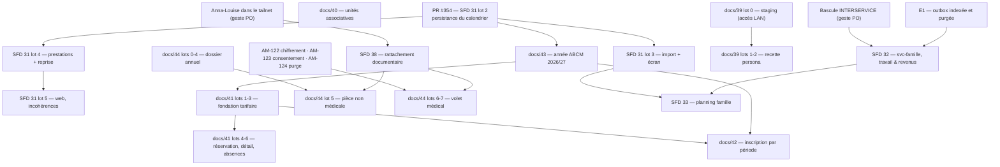

# 45 — Plan d'implémentation de la prochaine release

> Statut : **Plan de séquencement — à arbitrer PO** · Version 1.0 · 2026-09-01
> Relevé sur `main` **`80e2875`**, production **`0.18.0`** (19ᵉ train, déployé le 2026-08-30).
> Ce document **n'ajoute aucun périmètre** : il ordonne ce que les spécifications
> ([doc 31](31-sfd-calendriers-vacances-scolaires.md), [doc 32](32-sfd-travail-conges-revenus.md),
> [doc 33](33-sfd-planning-famille.md), [doc 38](38-sfd-rattachement-documentaire.md), et les
> documents `39` → `44` encore en revue), les plans d'exécution de `.claude/plans/` et le
> [registre d'améliorations](34-registre-ameliorations.md) portent déjà.
> Il répond à une intention PO explicite : **tout implémenter, puis couper une seule release**.

## 0. Ce que ce document décide, et ce qu'il ne décide pas

**Il décide** : l'ordre des chantiers, ce qui se parallélise et ce qui ne se parallélise pas, ce
qui est démarrable ce soir, et la règle de coupe.

**Il ne décide pas** : le contenu des spécifications — chacune porte ses propres décisions — ni la
validation des brouillons. Le §6 liste ce qui reste **à la main du PO**, et rien de ce qui en
dépend n'est placé dans une vague démarrable.

⚠️ **Six documents cités ici ne sont pas encore sur `main`.** Les SFD `39` (recette & agents QA,
validée v1.0), `40` → `44` (domaine associatif ABCM) et l'`ADR-0010` vivent dans les PR brouillon
#358 et #365. Ils sont donc désignés ici par leur **chemin**
(`docs/41-sfd-cantine-periscolaire-alsh-abcm.md`) et non par un lien : un lien vers un fichier
absent est un lien mort, que la porte `pnpm liens` refuse à raison. Les liens deviendront posables
au merge de ces deux PR — c'est le premier geste de la vague 0.

## 1. État de départ, mesuré

| Fait                              | Valeur                                                                                                                             |
| --------------------------------- | ---------------------------------------------------------------------------------------------------------------------------------- |
| `main`                            | `80e2875` — « le jeu de référence garantit sa date d'effet » (#363)                                                                |
| Production                        | `0.18.0`, déployée le 2026-08-30                                                                                                   |
| Mergé sur `main`, **non déployé** | #363 — le correctif du seed, celui qui avait fait refuser le train `0.18.0` par sa propre porte                                    |
| PR ouvertes portant du travail    | #354 (calendrier lot 2, **verte 21/21, non mergée**), #358 (SFD 39), #365 (SFD 40 → 44 + ADR-0010), #300 (passe README, brouillon) |
| PR de dépendances ouvertes        | #364 (32 bumps mineurs), #356, #346, et **#306 + #310 (FullCalendar 7)**                                                           |
| Ratchet ESLint                    | plafond **645** — mesurable en CI seulement (`EM-02`)                                                                              |

### 1.1 Constat négatif — ce que cet inventaire a corrigé de l'énoncé

Trois choses que l'on croyait, et qui sont fausses :

- **« Le lot 2 de la SFD 31 est en cours »** — il est **fini et vert** ; ce qui manque est un
  **merge**, pas du code. 42 fichiers, migration `0010`, contrat Pact et types web générés
  compris. C'est le déblocage le moins cher du dépôt.
- **« La séquence est 31 → 32 → 33 »** — elle l'était avant que le domaine associatif (40 → 44)
  existe. Trois de ces cinq spécifications se branchent sur le **lot 2 de la SFD 31**, pas sur les
  SFD 32/33 : la séquence utile a changé de forme, elle n'a pas seulement gagné des éléments.
- **« Le volet médical de la SFD 44 attend une décision »** — la décision est **prise**
  (`ADR-0010`, 2026-09-01 : stockage autorisé). Ce qui l'attend, ce sont **cinq préalables
  techniques cumulatifs**, dont deux n'existent nulle part dans le produit (`AM-122`, `AM-123`).

## 2. Inventaire — tout ce qui reste à implémenter

Statuts : **✅ prêt** (validé PO, aucun préalable ouvert) · **⏸ bloqué** (préalable nommé) ·
**❓ en attente PO** (le document lui-même n'est pas validé) · **⛔ écarté**.

Effort : **S** ≈ une session · **M** ≈ deux à trois · **L** ≈ au-delà, ou geste peu réversible.

### 2.1 SFD 31 — Calendriers d'ouverture & vacances scolaires (validée v1.0)

Plan : [`calendriers-vacances-scolaires.md`](../.claude/plans/calendriers-vacances-scolaires.md).

| Lot | Contenu                                                               | Statut              | Effort | Blocage / note                                                    |
| --- | --------------------------------------------------------------------- | ------------------- | ------ | ----------------------------------------------------------------- |
| 1   | Domaine calendrier versionné + fériés partagés                        | ✅ **mergé** (#352) | —      | `df77ebf`, non déployé                                            |
| 2   | Schéma versionné + API de lecture résolue (contrat figé)              | ✅ **prêt**         | S      | PR #354 **verte, à merger** — débloque trois autres SFD           |
| 3   | Import open data + écran calendrier (import, retouches, périodes)     | ✅ prêt             | M      | dépend du lot 2 ; les préalables C0 et C5 sont mergés             |
| 4   | Branchement génération de prestations + reprise `jour_non_facturable` | ✅ prêt             | M      | dépend du lot 2 ; écart de reprise **validé** (fermetures crèche) |
| 5   | Web : sélectionnabilité, visualisation, incohérences                  | ✅ prêt             | M      | dépend de 2 et 4 ; couvre `AM-105` et `AM-108`                    |
| —   | Alerte « vacances sans solution » (US-31-05)                          | ⛔ retirée          | —      | absorbée par le lot 5 de la SFD 33                                |

### 2.2 `docs/43` — Calendrier scolaire ABCM (brouillon v0.2, en attente PO)

SFD de **données**, pas de modèle : elle instancie le calendrier de la SFD 31 avec l'année 2026/27
et **répond à `Q-31-01`** — la zone B suffit pour les vacances, jamais pour les fenêtres d'ALSH,
qui sont des **retouches manuelles**, une par an, non dérivables d'une source publique.

| Lot | Contenu                                                        | Statut        | Effort | Blocage                                                  |
| --- | -------------------------------------------------------------- | ------------- | ------ | -------------------------------------------------------- |
| 0   | Attendre la persistance du calendrier                          | ⏸             | —      | **SFD 31 lot 2** (PR #354)                               |
| 1   | Les deux établissements : régime de fériés, services, horaires | ❓ attente PO | S      | `Q-43-02` (les deux sites ferment-ils aux mêmes dates ?) |
| 2   | L'année 2026/27 : périodes, fenêtres d'ALSH, réouverture 31/08 | ❓ attente PO | M      | `Q-43-03` (le 31 août : périscolaire seul ?)             |
| 3   | Repères de l'année, en couche informative sans effet           | ❓ attente PO | S      | —                                                        |
| 4   | Mode d'emploi du geste annuel                                  | ❓ attente PO | S      | —                                                        |

### 2.3 `docs/41` — Cantine, périscolaire & ALSH ABCM (brouillon v0.2, en attente PO)

Pièce centrale du domaine associatif. **Le « second moteur de tarification » n'est pas à écrire :
il facture déjà en production.** Ce qui manque est une **dimension de sa grille** — `grille_abcm`
est indexée sur la seule tranche, alors que les tarifs 2026 varient par **site**.

| Lot | Contenu                                                                       | Statut        | Effort | Blocage / note                                                               |
| --- | ----------------------------------------------------------------------------- | ------------- | ------ | ---------------------------------------------------------------------------- |
| 0   | Trancher `Q-41-01` → `Q-41-05`. Zéro code.                                    | ❓ attente PO | S      | décision pure                                                                |
| 1   | Élargir la clé de grille (tranche × site × niveau × date) + reprise           | ❓ attente PO | **L**  | `AM-110` ; **migration + rejeu de projection**, le geste le moins réversible |
| 2   | Niveau scolaire à date d'effet ; site tarifaire et services par établissement | ❓ attente PO | M      | `AM-114`, `AM-115`                                                           |
| 3   | Frais fixes versionnés (cotisation, première inscription)                     | ❓ attente PO | M      | `AM-111` ; solde la dernière exception à `RM-30-04`                          |
| 4   | Semaine de réservation : état, échéance dérivée, rappel                       | ❓ attente PO | M      | `AM-113`, `AM-118`                                                           |
| 5   | Détail réservé d'un mois, exportable ligne à ligne                            | ❓ attente PO | M      | frontière tenue avec le chantier facture                                     |
| 6   | Absences : motifs, carence paramétrée, affichage des sanctions                | ❓ attente PO | M      | `AM-116`, `AM-117` — carence à confronter à de vraies factures               |

> Les lots 1 → 3 sont des **fondations tarifaires** : `docs/42` et `docs/43` s'y appuient sans les
> refaire. Ils dépendent aussi du calendrier (SFD 31) : sans lui, « jour réservable » n'a aucune
> définition opposable.

### 2.4 `docs/42` — Vacances & ALSH (brouillon v0.1, en attente PO)

| Lot | Contenu                                                                | Statut        | Effort | Blocage                                         |
| --- | ---------------------------------------------------------------------- | ------------- | ------ | ----------------------------------------------- |
| 0   | Trancher `Q-42-01` et `Q-42-02`. Zéro code.                            | ❓ attente PO | S      | —                                               |
| 1   | Grain de créneau : six valeurs, formule dérivée, reprise prudente      | ❓ attente PO | M      | `AM-119` ; dépend de `docs/41` lots 1-2         |
| 2   | Inscription **par période**, retouches par jour, coût avant validation | ❓ attente PO | M      | la seule vraie fonctionnalité neuve du document |
| 3   | Échéance de période et rappel dans le récapitulatif existant           | ❓ attente PO | S      | —                                               |
| 4   | Vue des fenêtres d'été et de leur intervalle                           | ❓ attente PO | S      | dépend de `docs/43` lot 2                       |

> **Aucun lot ne démarre avant** que le calendrier soit persistant et interrogeable (SFD 31 lot 2).

### 2.5 `docs/40` — Unités associatives (brouillon v0.1, en attente PO)

**Le seul chantier du bloc 40 → 44 qui ne dépende de rien** — et réciproquement, rien ne dépend de
lui. Il tranche aussi le sort d'un domaine complet, écrit, testé et **branché nulle part**
(`UnitesAssociativesAbcm`, `AM-112`) : on le branche, ou on le retire ; le statu quo est refusé.

| Lot | Contenu                                                      | Statut        | Effort | Blocage                           |
| --- | ------------------------------------------------------------ | ------------- | ------ | --------------------------------- |
| 0   | Confirmer `Q-40-01` (quota, valeur, caution) et `Q-40-02`    | ❓ attente PO | S      | `EM-20` : source hors du dépôt    |
| 1   | Modèle et persistance : engagement, sessions, versionnement  | ❓ attente PO | M      | —                                 |
| 2   | Lecture et calcul : les trois compteurs, route, contrat Pact | ❓ attente PO | M      | `AM-112`                          |
| 3   | Écran mobile : saisie, tableau de bord des compteurs         | ❓ attente PO | M      | —                                 |
| 4   | Échéance dans le récapitulatif existant, arrêt automatique   | ❓ attente PO | S      | `AM-118` ; **aucun second canal** |

### 2.6 `docs/44` — Inscription, réinscription & pièces (brouillon v0.2)

Coupé en deux : un **volet ordinaire** livrable seul, et un **volet médical** qui ne démarre
qu'une fois ses **cinq préalables cumulatifs** réunis (`ADR-0010`, décision PO du 2026-09-01 :
stockage **autorisé**, sous conditions).

| Lot | Contenu                                                        | Statut        | Effort | Blocage                                                                                                                                                    |
| --- | -------------------------------------------------------------- | ------------- | ------ | ---------------------------------------------------------------------------------------------------------------------------------------------------------- |
| 0   | Trancher `Q-44-01` ; lignes du registre des traitements        | ❓ attente PO | S      | —                                                                                                                                                          |
| 1   | **Rappel de renouvellement du RFR** + affichage de la tranche  | ❓ attente PO | **S**  | **aucune dépendance** — le plus petit morceau de valeur du bloc (`AM-121`)                                                                                 |
| 2   | Dossier annuel, catalogue de pièces, états, report des valides | ❓ attente PO | M      | `Q-44-02`, `Q-44-03`                                                                                                                                       |
| 3   | Rappels avant rendez-vous et avant péremption                  | ❓ attente PO | S      | —                                                                                                                                                          |
| 4   | Personnes autorisées : données de tiers, export et effacement  | ❓ attente PO | M      | première fois que le produit porte des données de tiers                                                                                                    |
| 5   | Rattachement d'un justificatif **non médical**                 | ⏸             | M      | **SFD 38 livrée**                                                                                                                                          |
| 6   | **Les cinq préalables du volet médical** — ne se scinde pas    | ⏸             | **L**  | `AM-122` (chiffrement au repos), `AM-123` (consentement des deux parents), `AM-124` (purge effective), bord tailnet exclusif + porte de CI, type restreint |
| 7   | Volet médical : dépôt, consultation, révocation, expiration    | ⏸             | M      | lot 6 **entier**                                                                                                                                           |

### 2.7 SFD 38 — Rattachement documentaire (validée v1.0, variante `a1`)

Plan : [`rattachement-documentaire.md`](../.claude/plans/rattachement-documentaire.md).

| Lot | Contenu                                            | Statut | Effort | Blocage                                                            |
| --- | -------------------------------------------------- | ------ | ------ | ------------------------------------------------------------------ |
| 0   | Les écrits, le lien, le secret, le nœud tailnet    | ⏸      | M      | **Anna-Louise dans le tailnet** ; version de Paperless (doc 38 §8) |
| 1   | Second bord : identité tailnet et partition gardée | ⏸      | **L**  | lot 0 ; porte de CI anti-fuite                                     |
| 2   | Client Paperless dans la passerelle                | ⏸      | M      | lot 1                                                              |
| 3   | Dépôt depuis l'app                                 | ⏸      | M      | lot 2                                                              |
| 4   | Recherche plein texte et consultation              | ⏸      | M      | lot 2                                                              |
| 5   | Rattachement aux objets du dossier                 | ⏸      | M      | lot 4 ; consommé par le lot 5 de `docs/44`                         |

> Ce chantier **ne se parallélise pas** avec la SFD 31 : les deux touchent `gateway.openapi.ts`,
> l'oracle de routes et `bff.dto.ts`.

### 2.8 SFD 32 — Travail, congés & revenus (brouillon v0.1, NON validé PO)

Plan : [`travail-conges-revenus.md`](../.claude/plans/travail-conges-revenus.md).

| Lot | Contenu                                              | Statut        | Effort | Blocage                                                         |
| --- | ---------------------------------------------------- | ------------- | ------ | --------------------------------------------------------------- |
| 1   | Socle `svc-famille` (service neuf)                   | ❓ attente PO | **L**  | **`E1` — outbox indexée et purgée — précède tout service neuf** |
| 2   | Employeurs, contrats de travail versionnés, planning | ❓ attente PO | **L**  | lot 1                                                           |
| 3   | Absences typées, régimes, soldes, recalage paie      | ❓ attente PO | **L**  | lot 1 ; consomme `joursFeries` (SFD 31 lot 1, **livré**)        |
| 4   | Heures supplémentaires                               | ❓ attente PO | M      | lot 3                                                           |
| 5   | Revenus du foyer (multi-devises, deux vues impôt)    | ❓ attente PO | **L**  | **bascule `INTERSERVICE_AUTHZ_ENFORCE=1` avant ce lot**         |

### 2.9 SFD 33 — Planning famille (brouillon v0.1, NON validé PO — GELÉ)

Plan : [`planning-famille.md`](../.claude/plans/planning-famille.md). Gelé tant que **SFD 31
lots 1-3** et **SFD 32 lots 1-3** ne sont pas mergés. Absorbe US-31-05.

| Lot | Contenu                                                | Statut | Effort | Blocage                        |
| --- | ------------------------------------------------------ | ------ | ------ | ------------------------------ |
| 1   | Agrégation + vue jour/semaine en lecture seule         | ⏸      | **L**  | 31 lots 1-3 **et** 32 lots 1-3 |
| 2   | Trajets dépose / récupération                          | ⏸      | M      | lot 1                          |
| 3   | Événements libres multi-participants                   | ⏸      | M      | lot 1                          |
| 4   | Conflits CF-01 → 06 + acquittement                     | ⏸      | **L**  | lot 1 ; consomme le calendrier |
| 5   | Notification hebdomadaire des conflits (dont US-31-05) | ⏸      | M      | lot 4                          |

### 2.10 `docs/39` — Recette systématique & agents QA (validée v1.0)

| Lot   | Contenu                                                                  | Statut         | Effort | Blocage                                          |
| ----- | ------------------------------------------------------------------------ | -------------- | ------ | ------------------------------------------------ |
| 0     | **Remise en état de staging** — préalable bloquant                       | ⏸ **geste**    | M      | **accès LAN / poste principal** (`EM-20`)        |
| 1     | Agent de recette-persona « parent mobile », un parcours, verdict écrit   | ✅ dès lot 0   | M      | plus aucune décision ne l'attend                 |
| 2     | Clone évolutif du foyer réel + calibration du budget                     | ✅ dès lot 1   | **L**  | consentement des **deux** adultes + `T11` doc 37 |
| 3 → 5 | Personas gestionnaire/admin, intégration au train, campagne exploratoire | ⛔ non engagés | —      | **relus après le lot 1** — arrêt possible        |

### 2.11 Plan de consolidation — lots encore ouverts

Plan : [`consolidation-ui-et-qualite.md`](../.claude/plans/consolidation-ui-et-qualite.md).

| Lot    | Contenu                                                      | Statut  | Effort | Note                                                       |
| ------ | ------------------------------------------------------------ | ------- | ------ | ---------------------------------------------------------- |
| **E1** | Outbox : index partiel + purge, `processed_event` bornée     | ✅ prêt | M      | **préalable à tout service neuf** (SFD 32, factures)       |
| E2     | Index de lecture manquants — 46 tables pour 6 `CREATE INDEX` | ✅ prêt | M      | `AM-02` (P1) ; mesure avant/après exigée                   |
| E3     | Rétention des journaux applicatifs                           | ✅ prêt | S      | `AM-03`                                                    |
| B4     | Politique CVE sur images immuables                           | ✅ prêt | S      | `AM-10` ; décision de cadence, pas de code                 |
| B5     | E2E stack : réduire la sérialisation (`workers: 1`)          | ✅ prêt | M      | `AM-09`                                                    |
| B8     | Porte de poids du bundle web                                 | ✅ prêt | S      | `AM-04`                                                    |
| C6     | Composant commun `role="status"` / `alert` (~90 occurrences) | ✅ prêt | M      | optionnel (hypothèse H2)                                   |
| C8     | Combler les routes que la suite axe ne visite pas (16 vs 9)  | ✅ prêt | S      | `AM-05`                                                    |
| C9     | Fermer `style-src 'unsafe-inline'` — tout ou rien            | ✅ prêt | M      | `AM-06` ; 193 styles inline restants                       |
| D5     | Second tour du ratchet ESLint                                | ✅ prêt | M      | `AM-07` ; mesurable en CI seulement (`EM-02`)              |
| D7     | Familles de warnings à trancher                              | ✅ prêt | M      | dont `no-useless-constructor` (`AM-104`, 27 faux positifs) |

### 2.12 Dette de registre — pistes P1 encore ouvertes

| Piste             | Constat                                                    | Nature                                                     |
| ----------------- | ---------------------------------------------------------- | ---------------------------------------------------------- |
| `AM-02`           | 46 tables pour 6 index                                     | code — couvert par **E2**                                  |
| `AM-88`           | Purge T1 de `foyer_version` écrivable, jamais écrite       | code — **S**, avec sonde métier                            |
| `AM-52`           | Un échec de sauvegarde n'est signalé par rien              | ops + code — **S**                                         |
| `AM-100`          | Sonde applicative du battement à armer sur la production   | **geste serveur**, au train                                |
| `AM-18`           | Alertes Dependabot désactivées sur le dépôt                | **geste PO** (Settings → Code security)                    |
| `AM-30`           | Bascules de sécurité de la gateway fail-open et vides      | **geste PO** + écrit daté                                  |
| `AM-79`           | Bascule `INTERSERVICE_AUTHZ_ENFORCE=1`                     | **geste PO** — la fenêtre d'observation est enfin non vide |
| `AM-122`          | Chiffrement au repos exigé par l'`ADR-0010` : n'existe pas | préalable du volet médical                                 |
| `AM-33` / `AM-34` | RGPD — registre des traitements, effacement                | **statut de registre à re-trier** avant de replanifier     |

### 2.13 Hors de cette release

- **Plan « factures réelles »** ([`factures-reelles.md`](../.claude/plans/factures-reelles.md)) —
  brouillon, lot 0 bloquant PO, placé **après** la SFD 33 : il n'entre pas dans cette coupe. Il
  consommera le lot 5 de `docs/41` (détail réservé, exportable ligne à ligne).
- **`AM-63`** (échéances récurrentes du foyer, l'entretien du véhicule en premier cas) et
  **`AM-64`** (repas de la semaine) : aucune SFD ne les couvre, à lancer seuls et plus tard.
- **`AM-95`** (identité technique `creche-planner` vs produit « Martha ») : renoncement assumé,
  ne se rouvre qu'à un seuil de révision de l'`ADR-0009`.

## 3. Graphe de dépendances

### 3.1 Les six dépendances qui commandent tout le reste

| #   | Dépendance                                                 | Ce qu'elle bloque                                                               |
| --- | ---------------------------------------------------------- | ------------------------------------------------------------------------------- |
| 1   | **PR #354** (persistance du calendrier)                    | SFD 31 lots 3-5, `docs/43` entier, `docs/42` entier, `docs/41` lot 4            |
| 2   | **`docs/43`** (les dates réelles 2026/27)                  | la réservabilité de `docs/41` et `docs/42` — sans dates, aucune règle opposable |
| 3   | **`docs/41` lots 1-3** (fondation tarifaire)               | `docs/41` lots 4-6, `docs/42` lot 1                                             |
| 4   | **`E1`** (outbox indexée et purgée)                        | tout service neuf : `svc-famille` (SFD 32), `svc-facturation` plus tard         |
| 5   | **Anna-Louise dans le tailnet** (geste PO)                 | SFD 38 entière → donc `docs/44` lots 5, 6 et 7                                  |
| 6   | **`AM-122` / `AM-123` / `AM-124`** + bord tailnet exclusif | `docs/44` lots 6-7 — les cinq conditions sont **cumulatives**                   |

### 3.2 Les surfaces qui interdisent la parallélisation

Ce ne sont pas des dépendances fonctionnelles, mais des **collisions de fichiers** — elles se
paient en rebases, pas en défauts :

- `libs/contracts/kernel/src/lib/openapi/gateway.openapi.ts` et l'oracle de routes : **tout lot
  qui expose une route** y passe. La SFD 31, la SFD 38 et les quatre SFD ABCM y entrent toutes.
- `apps/web/src/api/openapi-types.gen.ts` et `pacts/` : régénérés, donc conflits systématiques.
- `docs/34-registre-ameliorations.md` : les identifiants `AM-xx` sont **contigus**, il n'y a
  aucune réservation possible — deux PR parallèles prennent le même numéro, et la seconde à
  merger renumérote. Le conflit git ne montre **que la ligne du tableau**, jamais les renvois.

C'est la raison unique du séquencement en vagues du §4 : le dépôt sait faire tourner deux
sessions, il ne sait pas faire tourner deux sessions qui écrivent dans le registre.

## 4. Ordre recommandé — vagues sérielles

Une vague = un lot de travail qu'une session mène de bout en bout, PR comprise. **Une seule vague
ouverte à la fois** sauf mention contraire explicite. Rien n'est déployé avant le §7.

### Vague 0 — Purger les PR en attente (S, immédiat)

1. **Merger #354** (SFD 31 lot 2). Verte 21/21. C'est la dépendance n°1 de tout le reste.
2. **Merger #358 et #365** (les six documents `39`, `40` → `44`, `ADR-0010`). Tant qu'ils sont en
   brouillon, aucun autre document ne peut y **lier**, et le registre y est dupliqué — donc chaque
   PR ouverte y prend un conflit d'identifiants.
3. **Statuer sur les PR Dependabot** : #364, #356, #346, et surtout **#306 + #310
   (FullCalendar 7)** — la migration FullCalendar 7 était nommée préalable du chantier vacances
   par la séquence PO. À merger **avant** le lot 5 de la SFD 31, qui retouche les calendriers.
4. **Mettre à jour ce document et [`docs/README.md`](README.md)** : poser les liens vers `39` → `44`
   une fois les fichiers sur `main`.

> ⚠️ Ces merges se font **un par un**, en rebasant : #358 et #365 modifient tous deux le §2 du
> registre. Le second à passer renumérote — c'est attendu, pas un incident.

### Vague 1 — Le socle calendrier (M → L, sériel)

SFD 31 lots **3 → 4 → 5**, dans cet ordre (3 et 4 sont parallélisables sur le papier — fichiers
disjoints hors schéma — mais le §3.2 conseille de les enchaîner, en mergeant 3 d'abord).

À la fin de cette vague, le produit sait ce qu'est un jour ouvert, un jour de vacances et un jour
fermé, **et le facture en conséquence**. C'est le préalable de tout le domaine associatif.

### Vague 2 — Les dates réelles (S → M, sériel)

`docs/43` lots **1 → 2 → 3 → 4**. Aucune ligne de modèle : ce sont des données, un écran de saisie
et un mode d'emploi. Effort faible, valeur immédiate — la vue de novembre 2026 doit montrer
exactement ce que le courrier de rentrée annonce.

**Décisions PO requises avant** : `Q-43-02`, `Q-43-03`.

### Vague 3 — La fondation tarifaire (L, sériel, le geste le moins réversible)

`docs/41` lots **1 → 2 → 3**. C'est la seule vague qui porte une **migration de clé de grille avec
reprise et rejeu de projection**. Deux précautions, tirées du dépôt :

- `LE-76` / `EM-17` : un correctif posé **à la création** est un no-op sur tout ce qui existe
  déjà, et invisible à une CI qui part d'un `down -v`. La reprise se prouve sur un état
  **préexistant**.
- Le seed est repassé une fois (#363) sur exactement ce motif : la porte de déploiement a eu
  raison contre le train.

**Décisions PO requises avant** : `Q-41-01` → `Q-41-05` (lot 0).

### Vague 4 — Ce que la fondation rend possible (M, deux pistes parallélisables)

Deux pistes **sans collision fonctionnelle**, mais qui touchent toutes deux `gateway.openapi.ts`
et le registre : les mener **en série de PR** même si elles peuvent être pensées ensemble.

- **4a** — `docs/41` lots **4 → 5 → 6** (réservation, détail exportable, absences).
- **4b** — `docs/42` lots **1 → 2 → 3 → 4** (créneaux, inscription par période, échéance, été).

### Vague 5 — Les chantiers indépendants (S → M, vraie parallélisation possible)

Ces trois-là ne se croisent ni entre eux, ni avec les vagues 1 → 4, **hors registre** :

- **5a** — `docs/40` lots **0 → 4** (unités associatives) : personne n'en dépend, il ne dépend de
  personne. Idéal pour une session isolée.
- **5b** — `docs/44` lots **0 → 4** (dossier annuel, sans aucune pièce médicale). Le **lot 1**
  (rappel de renouvellement du RFR) est le plus petit morceau de valeur réelle du bloc 40 → 44 et
  ne dépend de rien : c'est un bon premier geste si l'on veut un résultat visible vite.
- **5c** — la file de consolidation : **E1** (avant tout service neuf), puis **E2, E3, B8, C8,
  B4** ; **C9, D5, D7, C6, B5** ensuite, à l'appétit.

> Si deux sessions doivent tourner en même temps, c'est **ici** — et à la condition qu'une seule
> écrive dans `docs/34`. L'autre consigne ses lignes après le merge de la première.

### Vague 6 — Le documentaire, si son préalable tombe (L, sériel)

SFD 38 lots **0 → 5**, puis `docs/44` lot **5**. Ne démarre pas tant qu'Anna-Louise n'est pas dans
le tailnet. **Ne se parallélise pas avec la SFD 31** (mêmes surfaces) — d'où sa place après la
vague 1, jamais pendant.

### Vague 7 — Le volet médical, si les cinq conditions sont réunies (L, sériel)

`docs/44` lots **6** (entier, il ne se scinde pas) puis **7**. Exige `AM-122`, `AM-123`, `AM-124`,
le bord tailnet exclusif avec sa porte de CI, et le type restreint. **Trois de ces cinq conditions
n'ont aujourd'hui aucun code.** C'est le candidat n°1 à un report hors de cette release.

### Vague 8 — La famille, si les brouillons sont validés (L, sériel, la plus longue)

SFD 32 lots **1 → 5**, puis SFD 33 lots **1 → 5**. Deux réserves fermes :

- **E1 avant le lot 1** de la SFD 32 : `svc-famille` est un service neuf, il recopierait sinon
  une table d'outbox sans index ni purge.
- **La bascule `INTERSERVICE_AUTHZ_ENFORCE=1` avant le lot 5** (revenus). C'est un geste PO.

### Vague 9 — La recette, en parallèle du reste (M, hors code produit)

`docs/39` lot **0** (geste, exige le poste principal ou un accès LAN) puis lot **1**. Cette vague
est la seule qui puisse tourner **pendant** une autre sans collision : elle n'écrit ni route, ni
schéma, ni contrat. Sa valeur croît avec la taille de la release — et cette release sera grosse.

### Récapitulatif de séquencement

| Vague | Contenu                                            | Sériel / parallèle                             | Effort cumulé |
| ----- | -------------------------------------------------- | ---------------------------------------------- | ------------- |
| 0     | Merges en attente (#354, #358, #365, FullCalendar) | sériel, un par un                              | S             |
| 1     | SFD 31 lots 3-5                                    | sériel                                         | L             |
| 2     | `docs/43` lots 1-4                                 | sériel                                         | M             |
| 3     | `docs/41` lots 1-3                                 | sériel — migration                             | L             |
| 4     | `docs/41` lots 4-6 · `docs/42` lots 1-4            | deux pistes, PR en série                       | L             |
| 5     | `docs/40` · `docs/44` lots 0-4 · consolidation     | **parallélisable** (1 seul scribe du registre) | L             |
| 6     | SFD 38 lots 0-5 + `docs/44` lot 5                  | sériel, après vague 1                          | L             |
| 7     | `docs/44` lots 6-7                                 | sériel                                         | L             |
| 8     | SFD 32 puis SFD 33                                 | sériel                                         | XL            |
| 9     | `docs/39` lots 0-1                                 | **en parallèle de tout**                       | M             |

## 5. Prêt à démarrer maintenant

Sans aucune décision ni geste préalable, ce soir :

1. **Merger la PR #354** — verte, et c'est la dépendance n°1.
2. **SFD 31 lots 3, 4, 5** — validés v1.0, préalables C0 et C5 mergés.
3. **Toute la file de consolidation** : `E1`, `E2`, `E3`, `B4`, `B5`, `B8`, `C6`, `C8`, `C9`,
   `D5`, `D7`. Aucune n'attend personne.
4. **`AM-88`** (purge T1 de `foyer_version`) et **`AM-52`** (alerte d'échec de sauvegarde) — deux
   pistes P1 courtes, sans dépendance.
5. **`docs/39` lot 1**, dès que le lot 0 est levé depuis le poste principal.

En **attente d'une validation ou d'un geste** — et donc hors des vagues démarrables :

| En attente de                          | Ce qui se débloque                                |
| -------------------------------------- | ------------------------------------------------- |
| Validation PO de `docs/40` → `docs/44` | vagues 2, 3, 4, 5a, 5b                            |
| Validation PO des SFD 32 et 33         | vague 8 entière                                   |
| Anna-Louise dans le tailnet            | vague 6, puis `docs/44` lot 5                     |
| `AM-122` / `AM-123` / `AM-124` livrés  | vague 7                                           |
| Bascule `INTERSERVICE_AUTHZ_ENFORCE=1` | SFD 32 lot 5                                      |
| Accès LAN / poste principal            | `docs/39` lot 0, puis tout le reste de la recette |

## 6. Ce qui reste à la main du PO

### 6.1 Validations de documents

| Document                                   | Décision attendue                                           |
| ------------------------------------------ | ----------------------------------------------------------- |
| `docs/40` → `docs/44` (5 brouillons ABCM)  | valider, amender ou écarter — chacun porte ses questions §0 |
| [doc 32](32-sfd-travail-conges-revenus.md) | valider v0.1 → v1.0, ou reporter le volet travail/revenus   |
| [doc 33](33-sfd-planning-famille.md)       | idem — dernier chantier de la séquence 30 → 33              |
| `.claude/plans/factures-reelles.md`        | lot 0 bloquant : hypothèses fiscales et OCR                 |

### 6.2 Questions ouvertes à trancher, par document

- **`docs/40`** — `Q-40-01` (quota 20 UA, valeur 31,25 €, caution 625 € : encore valides pour
  2026/27 ?), `Q-40-02` (accès unique ou double accès portail : le quota change de moitié),
  `Q-40-03`, `Q-40-04`.
- **`docs/41`** — `Q-41-01` (Lutterbach accueille-t-il des élémentaires ?), `Q-41-02` (catégories
  de repas et leurs prix), `Q-41-03` (périscolaire du soir : forfait ou horaire ?), `Q-41-05`
  (facture individualisée en garde alternée : besoin du foyer ?). `Q-41-04` est tranchée, mais sa
  **vérification sur deux ou trois factures réelles** reste due.
- **`docs/42`** — `Q-42-01` (jeudi 12 h ou campagne dédiée ?), `Q-42-02` (« midi seul » : demi-journée
  - repas, ou repas seul ?), `Q-42-03` (ALSH du mercredi et des vacances : même tarif ?).
- **`docs/43`** — `Q-43-02` (les deux sites ferment-ils aux mêmes dates ?), `Q-43-03` (le 31 août :
  périscolaire seul, ou cantine aussi ?), `Q-43-04` (calendrier ALSH stable d'une année sur l'autre ?
  si oui, rouvrir `Q-31-03`).
- **`docs/44`** — `Q-44-01` (nouvelle tranche : au 1er janvier ou à réception ?), `Q-44-02` (quelles
  pièces ont une validité opposable ?), `Q-44-03` (dossier par enfant, ou par enfant et par
  établissement ?), `Q-44-04` (suivre adhésion et attestation employeur ?), `Q-44-06` (**comment**
  chiffrer au repos, concrètement).
- **[doc 31](31-sfd-calendriers-vacances-scolaires.md)** — `Q-31-01` est **répondue par `docs/43`** :
  zone B pour les vacances, retouches manuelles pour l'ALSH. Reste à l'acter dans la doc 31.

### 6.3 Gestes hors code

| Geste                                                       | Débloque                                  | Où                               |
| ----------------------------------------------------------- | ----------------------------------------- | -------------------------------- |
| **Anna-Louise dans le tailnet**                             | toute la SFD 38, puis `docs/44` lot 5     | serveur / compte Tailscale       |
| **Bascule `INTERSERVICE_AUTHZ_ENFORCE=1`** (`AM-79`)        | SFD 32 lot 5 ; solde le plan fondations   | prod, geste **isolé** d'un train |
| **Activer les alertes Dependabot** (`AM-18`)                | la veille de sécurité                     | Settings → Code security         |
| **Trancher les bascules fail-open de la gateway** (`AM-30`) | `AM-96` (bord d'authentification)         | `.env.server.enc`                |
| **Armer la sonde applicative du battement** (`AM-100`)      | la supervision dit enfin la vérité        | au prochain train                |
| **Remettre staging en état** (`docs/39` lot 0)              | toute la recette par agents               | LAN / poste principal            |
| **Confirmer le quota UA 2026/27** (`Q-40-01`, `EM-20`)      | `docs/40` entier                          | règlement intérieur ABCM         |
| **Corriger à la main le contrat `f2899521…`**               | rien — mais la surfacturation ~27 % court | prod, correction de donnée       |

## 7. La règle de release

**Tout se merge sur `main` au fil de l'implémentation. Rien ne se déploie avant la coupe.**

1. **Chaque lot part en PR et se merge normalement.** Le job `ci` reste la porte : `pnpm check`,
   `pnpm pieges`, `pnpm frontieres`, `pnpm registre`, `pnpm empechements`, `pnpm readme`. Aucune
   exception n'est ouverte pour « aller plus vite avant la release ».
2. **Aucun `deploy.mjs`, aucun train, tant que le backlog validé n'est pas vidé.** Un déploiement
   au fil de l'eau ferait de chaque vague une vérification live séparée, ce que l'intention PO
   écarte explicitement.
3. **Les gestes serveur en attente s'accumulent et se rejouent en une fois** au train final :
   `AM-100` (sonde du battement), la recopie de l'unité `creche-heartbeat` — **l'unité, pas
   seulement son env**, elle seule porte `StateDirectory=` — et la vérification `AM-94` (les ports
   de prod restent en loopback).
4. **La coupe se prépare, elle ne s'improvise pas.** Avant le train :
   - `docs/39` lot 1 rejoue le parcours d'un vrai parent sur staging — c'est **exactement** ce
     pour quoi cette SFD existe, et cette release est la plus grosse jamais coupée ;
   - relire le **récapitulatif ops** de chaque plan livré : la SFD 31 en porte un (comparaison de
     coûts après reprise des `jour_non_facturable`), la SFD 38 aussi ;
   - vérifier que la migration de grille (`docs/41` lot 1) a son **rejeu de projection** au
     runbook, et non un simple redémarrage.
5. **Le risque assumé, écrit ici pour ne pas être découvert au train** : plus la coupe est grosse,
   moins un rollback attribue la panne. La `0.17.0` l'a montré (`LE-58`) et la `0.18.0` a été
   refusée par sa propre porte. Deux contre-mesures, toutes deux déjà dans le dépôt : la porte 3
   du déploiement, et le verdict de recette de `docs/39`. **La bascule `INTERSERVICE` reste hors
   du train**, isolée — c'est sa règle propre (`AM-79`).

## 8. Ce que ce plan ne couvre pas

- **Le contenu des décisions PO** : ce document les liste, il n'en préjuge d'aucune. Une réponse
  différente de celle qu'une SFD recommande déplace des lots, elle n'invalide pas les vagues.
- **L'estimation en temps** : S/M/L est une taille relative, pas une durée. Le budget réel du
  projet est de l'ordre de sept heures par semaine (`docs/39` §9) — à ce rythme, les vagues 0 → 5
  sont un trimestre, pas un mois.
- **Ce qui se découvrira en implémentant.** Chaque lot commence par un **constat négatif** :
  vérifier l'énoncé contre le code réel, et regarder la **sortie** de l'outil censé garder le
  sujet, pas seulement son code. C'est ce geste qui a trouvé les défauts les plus coûteux de ce
  dépôt — et c'est lui, pas ce plan, qui dira si une vague tient.
